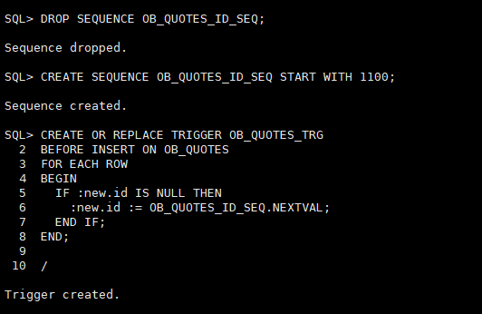

<!-- TOC -->

- [1.1. 环境说明](#11-环境说明)
  - [1.2. 环境搭建](#12-环境搭建)
  - [1.3. 常见问题](#13-常见问题)
    - [1.3.1. 关联id保存失真](#131-关联id保存失真)
      - [问题描述](#问题描述)
      - [表结构](#表结构)
      - [问题特征](#问题特征)
      - [问题源](#问题源)
      - [解决措施](#解决措施)
      - [创建序列及触发器示例](#创建序列及触发器示例)

<!-- /TOC -->
# 1.1. 环境说明

名称|版本
-|-
oracle| 11g+
ruby|2.3.7
rails|4.1.7
ruby-oci8|2.2.5.1
activerecord-oracle_enhanced-adapter|1.5.6

## 1.2. 环境搭建


## 1.3. 常见问题
### 1.3.1. 关联id保存失真
#### 问题描述

现有两张表,orders和order_items,关系如下表所示.<br>
订单保存后问题在于订单保存的产品并非下单时所购买的产品.<br>
通过断点发现了比较关键的特征.

#### 表结构

&nbsp;|orders|order_items
-|-|-
关联关系|一|多
关联字段||order_id

#### 问题特征

时间点|orders|order_items
-|-|-
前|id为503|order_id为503
后|id为504|order_id为503

#### 问题源

和触发器有关,保存时id已存在,但在触发器的作用下id又发生了变化

#### 解决措施

创建触发器时判断应自增序列是否null,如果为null再触发.

#### 创建序列及触发器示例

```sql
DROP SEQUENCE #{table_name}_ID_SEQ;

CREATE SEQUENCE #{table_name}_ID_SEQ START WITH #{last_id + num};

CREATE OR REPLACE TRIGGER #{table_name}_TRG
BEFORE INSERT ON #{table_name}
FOR EACH ROW
BEGIN
  IF :new.id IS NULL THEN
    :new.id := #{table_name}_ID_SEQ.NEXTVAL;
  END IF;
END;
/

```
`/` 为必须项

触发器执行成功示例:




