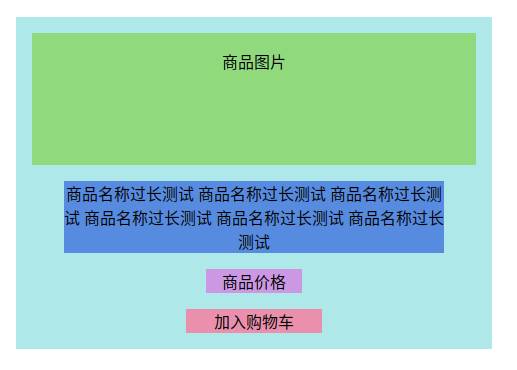

>该文档主要介绍商品卡片(简介)组件的主要构成及其实现逻辑.

<!-- TOC -->

- [构成](#构成)
  - [sass](#sass)

<!-- /TOC -->

# 构成

卡片主要由以下几部分构成:

0. 商品图片
0. 商品名称
0. 商品价格
0. 加入购物车按钮

> 布局

在梳理完组件的主要组成部分后. 
个人比较倾向于先将组件的布局样式搭好再去向里面填充具体内容. 
如下图所示：

## sass

在本插件中首次运用了sass编写样式. 
可以称之为样式树吧,写起来很舒服.
