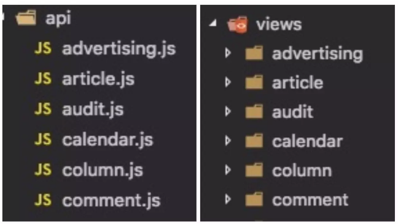

> 根据GitHub上 [vue-element-admin](https://github.com/PanJiaChen/vue-element-admin)项目总结Vue开发规范

<!-- TOC -->

- [环境](#环境)
- [目录结构](#目录结构)
  - [标准示例](#标准示例)
  - [src](#src)
    - [api和views](#api和views)
    - [components](#components)
- [alias的使用](#alias的使用)
- [ESLint](#eslint)
  - [eslint+vscode](#eslintvscode)
- [封装 axios](#封装-axios)

<!-- /TOC -->

# 环境

名称|版本
-|-
webpack|
vue|


# 目录结构

## 标准示例

```
├── build                      // 构建相关  
├── config                     // 配置相关
├── src                        // 源代码
│   ├── api                    // 所有请求
│   ├── assets                 // 主题 字体等静态资源
│   ├── components             // 全局公用组件(页面级的组件放在各自views文件下)
│   ├── directive              // 全局指令
│   ├── filtres                // 全局 filter
│   ├── icons                  // 项目所有 svg icons
│   ├── lang                   // 国际化 language
│   ├── mock                   // 项目mock 模拟数据
│   ├── router                 // 路由
│   ├── store                  // 全局 store管理
│   ├── styles                 // 全局样式
│   ├── utils                  // 全局公用方法
│   ├── vendor                 // 公用vendor
│   ├── views                  // view
│   ├── App.vue                // 入口页面
│   ├── main.js                // 入口 加载组件 初始化等
│   └── permission.js          // 权限管理
├── static                     // 第三方不打包资源
│   └── Tinymce                // 富文本
├── .babelrc                   // babel-loader 配置
├── eslintrc.js                // eslint 配置项
├── .gitignore                 // git 忽略项
├── favicon.ico                // favicon图标
├── index.html                 // html模板
└── package.json               // package.json

```

## src

### api和views

根据业务模块来划分 views,并且将views和api两个模块一一对应,从而方便维护:



### components

components放置的都是全局公用的一些组件,如上传组件,富文本等等.<br>
一些页面级的组件建议还是放在各自views文件下,方便管理.

# alias的使用

alias可用来对常用文件夹建立别名,从而在该别名的基础上通过相对路径指向特定文件:

webpack.config.js:

```js
...
module.exports = {
  resolve: {
    // extensions用于设置扩展名,在使用中只需声明文件名称可省略后缀.
    extensions: ['.js', '.vue', '.json'],
    alias: {
      '~': path.resolve(__dirname, 'src')
    }
  }
}
```

使用:

```js
import stickTop from '~/components/stickTop'
```

# ESLint

>eslint是在ECMAScript/JavaScript代码中识别和报告模式匹配的工具,它的目标是保证代码的一致性和避免错误.

## eslint+vscode 

安装步骤: 

0. vscode: 安装eslint插件
0. vscode: 文件>首选项>设置>右上角(更多操作)>打开setting.json文件>写入:

```js
"eslint.validate": [
  "javascript",
  "javascriptreact",
  "html",
  {
    "language": "vue",
    "autoFix": true
  }
],
"eslint.options": {
  "plugins": ["html"]
}
```

上面的配置文件中作者还有将vscode的自动保存关闭:

```js
"files.autoSave":"off",
```

原因是:eslint会在文件保存时去校验.

2. 项目根目录下: 新建.eslintrc.js文件,常用配置内容推荐[PanJiaChen的常用配置](./.eslintrc.js)


# 封装 axios


<hr>

> [掘金|手摸手，带你用vue撸后台 系列一（基础篇）](https://juejin.im/post/59097cd7a22b9d0065fb61d2)