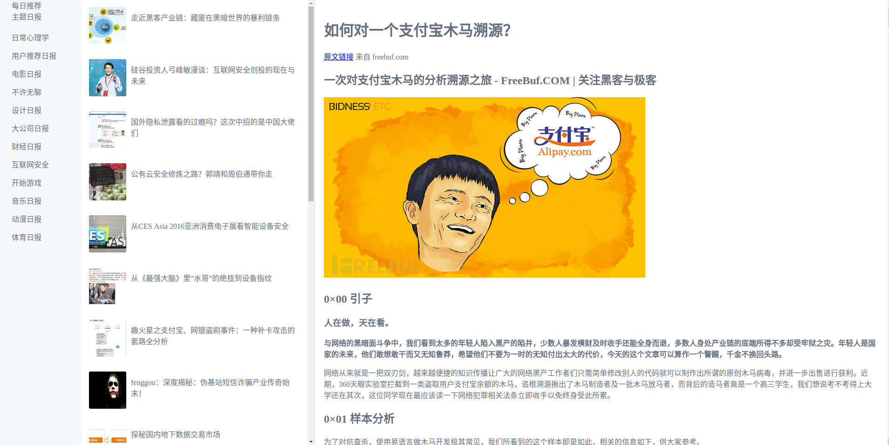

<!-- TOC -->

- [1. 项目一期](#1-项目一期)
  - [1.1. 背景](#11-背景)
  - [1.2. 页面概览](#12-页面概览)
  - [1.3. 完成情况](#13-完成情况)
    - [1.3.1. 导航栏](#131-导航栏)
      - [1.3.1.1. 每日推荐](#1311-每日推荐)
      - [1.3.1.2. 主题日报](#1312-主题日报)
    - [1.3.2. 文章列表](#132-文章列表)
    - [1.3.3. 文章详情](#133-文章详情)
- [2. 项目二期](#2-项目二期)
    - [2.0.4. 代办事宜](#204-代办事宜)
- [3. 项目常见问题及解决方案](#3-项目常见问题及解决方案)
  - [3.1. 图片代理获取403问题](#31-图片代理获取403问题)
- [4. 参考资料](#4-参考资料)
  - [4.1. 一期](#41-一期)

<!-- /TOC -->

# 1. 项目一期

## 1.1. 背景

该项目为Vue.js(2.x)+webpack(4.x)基于[知乎日报API接口](https://github.com/izzyleung/ZhihuDailyPurify/wiki/知乎日报-API-分析)打造的Vue.js入门程序.

## 1.2. 页面概览

## 1.3. 完成情况

项目一期主要跟随梁灏先生在《Vue.js实战》一书中完成的'知乎日报项目开发'独立的单页面小应用而来. 
页面布局方面主要分类三块区域:

0. 左侧导航栏(文章分类)
0. 中部文章列表部分,随文章分类变动而变换.
0. 主体部分:文章详情阅读部分,点击列表文章标题进行切换.

### 1.3.1. 导航栏

最左侧导航栏用于文章分类展示,分为两大类:每日推荐和主题日报.

两者的切换是通过一个`type`属性值的不同来判断切换的.

#### 1.3.1.1. 每日推荐

每日推荐为默认选中分类,默认情况下文章列表页面显示的内容也是每日推荐分类下的内容.

通过调用知乎日报的 `news/latest`[1] 接口获取最新消息.

#### 1.3.1.2. 主题日报

主题日报下分为日常心理学等十二个种类在内的文章分类.

这些分类信息是通过 `themes` 接口来获取的.

通过点击不同分类调用API的 `theme/分类id` 接口获取最新新闻来刷新文章列表部分.

### 1.3.2. 文章列表

文章列表部分是作为一个组件 `Item` 为页面提供页面渲染.

通过循环组件来渲染列表部分.组件的组成部分也比较简单,分为左侧的图片部分和右侧的标题部分.

在点击组件时会触发点击事件,事件会改变 `articleId` 也就是文章详情部分的文章id.

### 1.3.3. 文章详情

文章详情部分也是一个名叫 `Article` 的组件来提供页面渲染的.

组件分为:文章正文和评论两部分.

文章列表中提到点击会触发点击事件从而改变articleId. 
在组件内部有一个监听属性,当文章id发生变化时会通过API的 `news/文章id` 接口去获取正文信息. 
在正文获取完毕后还会调用 `story/文章id/short-comments` 短评接口去获取文章对应的短评并在正文下方进行展示.

# 2. 项目二期

### 2.0.4. 代办事宜

0. 对项目文件结构按照最佳实践进行重构.
0. 每日推荐下拉至底部后自动加载历史消息.
0. 文章评论添加长评和短评切换产看功能.

# 3. 项目常见问题及解决方案

## 3.1. 图片代理获取403问题

# 4. 参考资料

## 4.1. 一期

> [梁灏 | Vue.js实战](https://github.com/icarusion/vue-book)

> [GitHub | 知乎日报-API-分析](https://github.com/izzyleung/ZhihuDailyPurify/wiki/知乎日报-API-分析)

[1]: 这里省略了通用前缀:https://news-at.zhihu.com/api/4/
