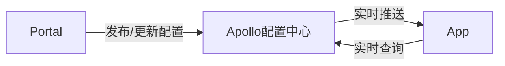
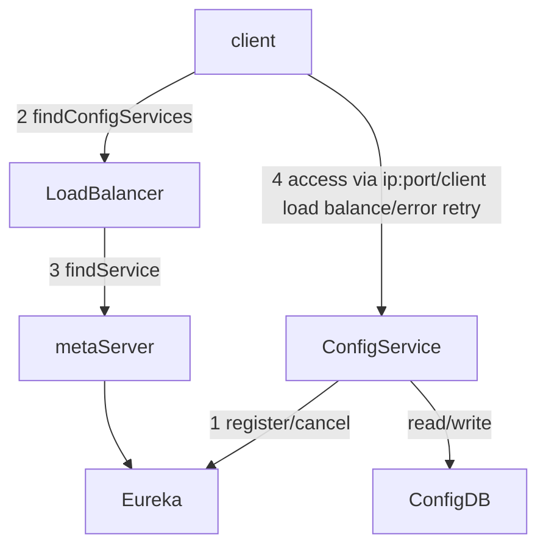
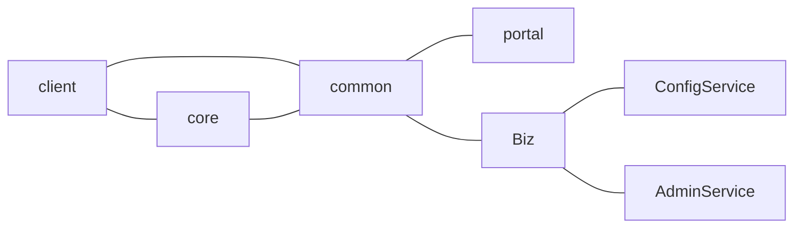

<!-- TOC -->

- [1. 常用语法](#1-常用语法)
  - [1.1. 转义字符](#11-转义字符)
  - [1.2. 引用](#12-引用)
    - [1.2.1. 单一层级](#121-单一层级)
    - [1.2.2. 多层级](#122-多层级)
  - [1.3. 行内标记](#13-行内标记)
  - [1.4. 代码块](#14-代码块)
  - [1.5. 链接](#15-链接)
    - [1.5.1. 内链式](#151-内链式)
    - [1.5.2. 引用式](#152-引用式)
  - [1.6. 表格](#16-表格)
  - [1.7. 内嵌css样式](#17-内嵌css样式)
  - [1.8. 语义标记/标签](#18-语义标记标签)
    - [1.8.1. *斜体*](#181-斜体)
    - [1.8.2. **加粗**](#182-加粗)
    - [1.8.3. ***斜体+粗体***](#183-斜体粗体)
    - [1.8.4. ~~删除线~~](#184-删除线)
    - [1.8.5. _突出_](#185-_突出_)
  - [1.9. 脚注](#19-脚注)
  - [1.10. 自动链接](#110-自动链接)
  - [1.11. 插入图像](#111-插入图像)
  - [1.12. 有序列表](#112-有序列表)
  - [1.13. 转义符号](#113-转义符号)
  - [1.14. 空&nbsp;格&emsp;符](#114-空nbsp格emsp符)
  - [1.15. 注释](#115-注释)
  - [1.16. 流程图](#116-流程图)

<!-- /TOC -->
# 1. 常用语法
## 1.1. 转义字符
由于markdown支持html语法,当需要html标签原样展示时,可以使用一下转义字符.
显示结果|描述|实体名称|实体编号
-|-|-|-
&nbsp; |空格|\&nbsp;|\&#160;
<|小于号|\&lt;|\&#60;
\>|大于号|\&gt;|\&#62;
&|与号|\&amp;|\&#38;
“|号|\&quot;|\&#34;
‘|撇号|\&apos;|\&#39;

## 1.2. 引用
### 1.2.1. 单一层级
回车表示引用结束
```markdown
> hello world<br>
end

end
```
> hello world<br>
end

end

### 1.2.2. 多层级

```markdown
> 外层
>> 里层
>>> 最内层
```

> 外层
>> 里层
>>> 最内层

## 1.3. 行内标记

```markdown
`标记内` 标记外
```
`标记内` 标记外

## 1.4. 代码块
` ```语言名称 ` 可根据不同的语法进行着色<br>

```html
<body>
</body>
```

## 1.5. 链接

### 1.5.1. 内链式

```markdown
[谷歌](www.google.com '碾压百度')
```
[谷歌](www.google.com '碾压百度')


### 1.5.2. 引用式
```markdown
[baidu]: http://www.baidu.com '百度一下'
[百度][baidu]
```

[baidu]: http://www.baidu.com '百度一下'
[百度][baidu]

## 1.6. 表格
**:** 代表对齐方式

```markdown
居中|左对齐|右对齐
:-:|:-|-:
居中|左对齐|右对齐|
===============|===============|===============

```
居中|左对齐|右对齐
:-:|:-|-:
居中|左对齐|右对齐|
===============|===============|===============

## 1.7. 内嵌css样式
```markdown
<p style="color: #AD5D0F;font-size: 18px; font-family: '宋体';">
内嵌样式
</p>
```
<p style="color: #AD5D0F;font-size: 18px; font-family: '宋体';">
内嵌样式
</p>

## 1.8. 语义标记/标签
### 1.8.1. *斜体*

```markdown
*斜体*
```

### 1.8.2. **加粗**
```markdown
**加粗**
```
### 1.8.3. ***斜体+粗体***

```markdown
***斜体+粗体***
```
### 1.8.4. ~~删除线~~

```markdown
 ~~删除线~~
```
### 1.8.5. _突出_

```markdown
_突出_
```

## 1.9. 脚注

```markdown
我<sup>[1]</sup>

[1]: 这里指我自己
```
我<sup>[1]</sup>

[1]: 这里指我自己

## 1.10. 自动链接

```markdown
<http://google.com>

<ff4c00@gmail.com>
```

<http://google.com>

<ff4c00@gmail.com>

## 1.11. 插入图像
和创建超链接的方式类似,区别在于感叹号`!`
```markdown
![who am I][who]

[who]:https://raw.githubusercontent.com/ff4c00/markdown/master/images/life/849156087.jpg "who am I"
```
![who am I][who]

[who]:https://raw.githubusercontent.com/ff4c00/markdown/master/images/life/849156087.jpg "who am I"


> [知呼 | Markdown中插入图片有什么技巧？](https://www.zhihu.com/question/21065229)
## 1.12. 有序列表
这里之所以都选0,是因为如果顺序需要调整,代码不需要任何改动.

```markdown
0. 首先
0. 其次
0. 然后
0. 最后
```

0. 首先
0. 其次
0. 然后
0. 最后

## 1.13. 转义符号

```markdown
\*斜体\*
```

\*斜体\*

## 1.14. 空&nbsp;格&emsp;符

```markdown
空&nbsp;格&emsp;符
```

## 1.15. 注释

```markdown
<!-- html注释语法 -->
```
## 1.16. 流程图

语法|说明
-|-
graph TB|top->botom 上->下
graph BT|botom->top 下->上
graph LR|left->right 左->右
graph RL|right->left 右->左
-->|在流程图中显示——>
---|在流程图中显示——








<hr>

> [简书 | 欧薇娅](https://www.jianshu.com/p/b03a8d7b1719)

> [为Markdown文件自动生成目录](https://www.jianshu.com/p/4721ddd27027)

> [CSDN | 半美人的博客 | VSCode编辑流程图、时序图等的环境配置](https://blog.csdn.net/m0_37639589/article/details/77684333)

> [Github | mermaid文档](https://mermaidjs.github.io/)

> [博客园 | Markdown中使用mermaid画流程图](https://www.cnblogs.com/nanqiang/p/8244309.html)
